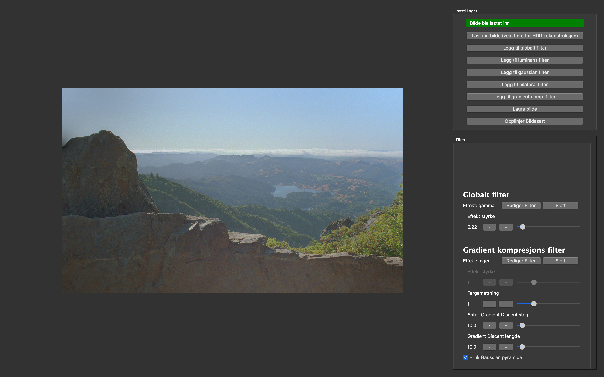

# Prosjektoppgave for IMT3881 Vitenskapelig programmering, våren 2019

Oppgaveteksten ligger i katalogen `oppgave`. Kildekoden dere lager skal ligge i katalogen `src` og rapporten skal ligge i `rapport`.

## GUI

<p align="center">

</p>

### Start GUI

Kjør komandone under for å laste ned de nødvendige rammeverkene og for å kjøre GUI-en.
```bash
python get-pip.py
pip install -r requirements.txt
cd kode
python app.py
```
